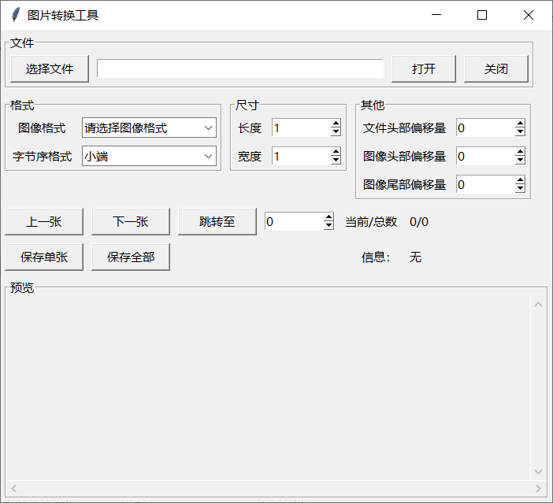
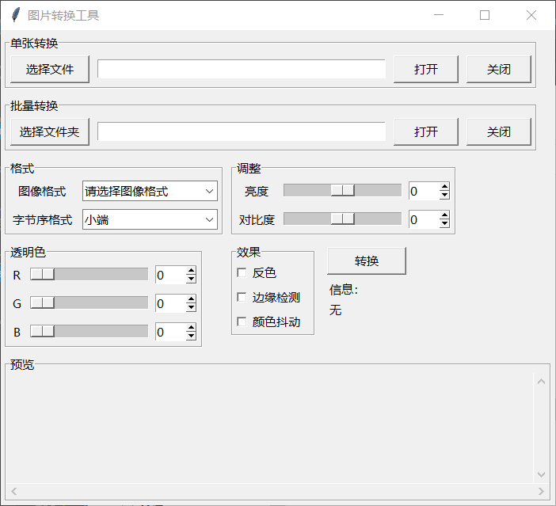
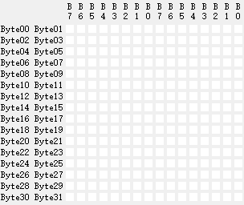
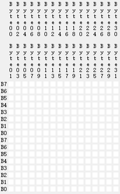
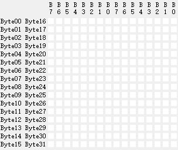
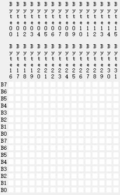
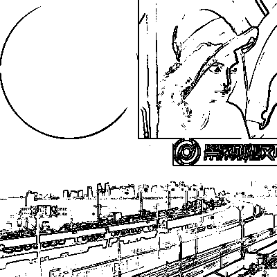

# 简介
本工具可以轻松将BMP图片转换为黑白位图、RGB565、ARGB565等单片机常用格式，也可将转换后的图片还原为电脑可查看的PPM格式。是你为单片机转换图片、制作动画的实用工具！  
核心代码采用C语言编写，灵活高效，同时方便移植至单片机；图形界面采用python编写，人生苦短，我用python。  
  
  

*本文中将bmp、jpg、gif、png、webp等图片格式简称为常见图片格式，将本工具所转换的bitmap、rgb565等格式简称为单片机图片格式*

# 编译
*请自行安装MinGW-w64或TDM-GCC等编译工具链*

## 仅dll
`gcc -shared .\img_common.c .\img_enc.c -o img_enc.dll`  
`gcc -shared .\img_common.c .\img_dec.c -o img_dec.dll`  

## exe+dll
`gcc -L .\ -limg_enc -limg_dec .\argparse.c .\main.c -o img_convertor.exe`  

## 独立exe
`gcc .\img_common.c .\img_dec.c .\img_enc.c .\argparse.c .\main.c -o img_convertor.exe`  

# 使用方法

## 基本用法
* 安装python，在官网找自己系统对应的 https://www.python.org/downloads/
* 安装完成后如果一切顺利，那么直接双击运行 img_enc_gui.pyw 或 img_dec_gui.pyw
* img_enc_gui 用于编码，可以将BMP图片转换为单片机图片格式（以及C数组），支持若干图像效果，支持批量转换
* img_dec_gui 用于解码，可以将单片机图片转换为PPM格式，支持批量转换（PPM图片可使用Honeyview、Photoshop等软件查看）
* 不想用图形界面的还有命令行，功能基本一致（不支持批量转换）

## 图像格式说明
| 格式     | 说明                                                |
| :------- | :-------------------------------------------------- |
| bitmap   | 位图，或单色像素图                                  |
| web      | 8位216色 web-color（颜色索引请查看 img_common.c）   |
| rgb565   | 略                                                  |
| bgr565   | 略                                                  |
| argb1555 | 带透明的rgb格式，最高位为透明度，1为不透明，0为透明 |
| bgra5551 | 带透明的rgb格式，最低位为透明度，1为不透明，0为透明 |

## 位图格式说明
位图一共有8种格式，8种格式的区别在于像素排列顺序不同，请根据实际情况进行选择。  
宽度或高度会向上对8取整，例如15*9像素的图片，横向需要(15 / 8) * 9 = 18字节内存，纵向需要 15 * (9 / 8) = 30 字节内存。  

### 逐行LSB（RL）
从第一行开始向右每取8个点作为一个字节，第一个点作为最低有效位  
  

### 逐行MSB（RM）
从第一行开始向右每取8个点作为一个字节，第一个点作为最高有效位  
  

### 逐列LSB（CL）
从第一列开始向下每取8个点作为一个字节，第一个点作为最低有效位  
  

### 逐列MSB（CM）
从第一列开始向下每取8个点作为一个字节，第一个点作为最高有效位  
  

### 行列LSB（RCL）
从第一行第一列开始向右取8个点作为一个字节，再从第二行第一列开始向右取8个点作为第二个字节……然后从第一行第九列开始向右取8个点作为一个字节，以此类推，第一个点作为最低有效位  
  

### 行列MSB（RCM）
从第一行第一列开始向右取8个点作为一个字节，再从第二行第一列开始向右取8个点作为第二个字节……然后从第一行第九列开始向右取8个点作为一个字节，以此类推，第一个点作为最高有效位  
  

### 列行LSB（CRL）
从第一列第一行开始向下取8个点作为一个字节，再从第二列第一行开始向下取8个点作为第二个字节……然后从第一列第九行开始向下取8个点作为一个字节，以此类推，第一个点作为最低有效位  
  

### 列行MSB（CRM）
从第一列第一行开始向下取8个点作为一个字节，再从第二列第一行开始向下取8个点作为第二个字节……然后从第一列第九行开始向下取8个点作为一个字节，以此类推，第一个点作为最高有效位  
  

## 图像效果说明
img_enc 工具支持的图像效果如下，未说明则不支持  
* 位图格式支持反色、边缘检测、颜色抖动、亮度、对比度  
* WEB格式支持颜色抖动  
* RGB565、BGR565、ARGB1555、BGRA5551支持颜色抖动、大小端  
* ARGB1555、BGRA5551支持透明色  

常见图像效果如下
* 原图  
     
* 位图+边缘检测+反色  
     
* 位图+抖动  
     
* WEB  
     
* WEB+抖动  
     

## 更多用法
* 安装FFmpeg
* 在 FFmpeg 官网(https://www.ffmpeg.org/download.html)下载对应系统的 release 版本，看清楚是release版本，不要下载源码  
* 可以将 FFmpeg 添加到PATH环境变量，方便以后使用  
* 更详细的用法 `ffmpeg.exe -help full` 自己看，这里列举几个配合图片转换工具会用到的几个命令  

### 将视频转换为一系列BMP
`.\ffmpeg.exe -i video.mp4 -vf scale=48:32 -frames 400 %04d.bmp`  
这里简单解释一下这些命令参数  
`-i video.mp4` 要转换的文件名  
`-vf scale=48:32` 视频缩放尺寸，例如屏幕是64x32，假设想要转换一个4:3的视频并在不拉伸的情况下铺满屏幕，简单计算一下缩放后的长宽就是48x32，不加这个参数就不进行缩放  
`-frames 400` 转换前多少帧，不加这个参数就是转换全部  
`%04d.bmp` 输出文件名，有C语言基础都看得懂  

### 转换图片格式
`ffmpeg -i input.jpg output.bmp`  
添加 `-vf scale=W:H` 参数可进行缩放  

# Q&A

## 为什么我运行 img_enc_gui.pyw （或 img_dec_gui.pyw） 没有看到图形界面（或打开了编辑器等）？
请使用 pythonw 运行，比如指定 pythonw.exe 为 pyw 文件的默认程序，或从命令行用 pythonw.exe 执行这 pyw 脚本  

## 为什么我运行 img_enc_gui.pyw （或 img_dec_gui.pyw） 有的GUI组件看不到，或布局不正常等情况？
windows 对高分屏的适配比较差，找到 pythonw.exe 的路径，右键->属性->兼容性->更改高DPI设置->这里面的设置改一改试试，不同电脑屏幕像素密度也不同，具体设置成什么样我也不知道  

## 能添加对jpg、png等其他常见格式的支持吗？
目前只支持打开bmp格式，保存PPM格式，未来也不打算支持其他格式的图片。  
常见图片格式之间的转换有很多软件都可以做，交给它们来做更合适，而且比我做得更好，我没必要重复造轮子。  
对于bmp以外的其他格式图片请使用画图、photoshop、acdsee等软件将图片转为bmp格式后再使用本工具转换为单片机格式。  

## 能支持更多的图像效果吗？
有能力的话可以自己开发，对我来说目前这几种图像效果已经够用了，暂时不打算支持更多效果。  
当然我也不想造轮子，就算造出来也不如专业图像软件好。如有需要其他图像效果请使用ps等专业软件进行处理。  

## 命令行不会用？
https://learn.microsoft.com/zh-cn/training/modules/introduction-to-powershell/  
https://learn.microsoft.com/zh-cn/powershell/scripting/learn/ps101/01-getting-started?view=powershell-7.3  
微软官方 PowerShell 的使用教程，自学  

## python不会用？
https://www.runoob.com/python3/python3-tutorial.html  
教程在这里，自学  

## 可我还是不会用，能教我吗？
请按下 Alt + F4 组合键  
